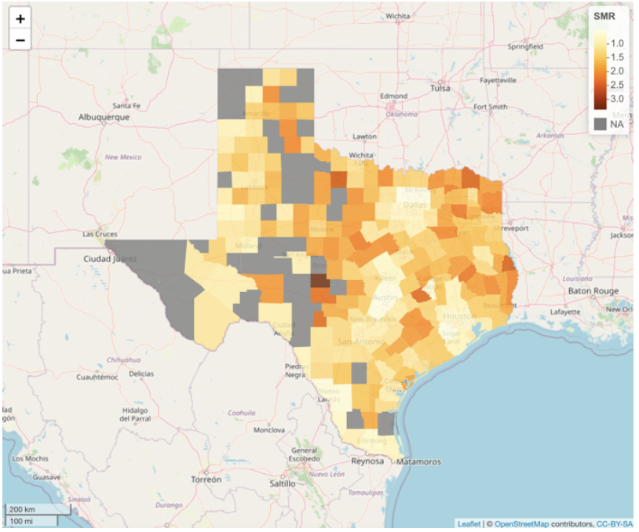
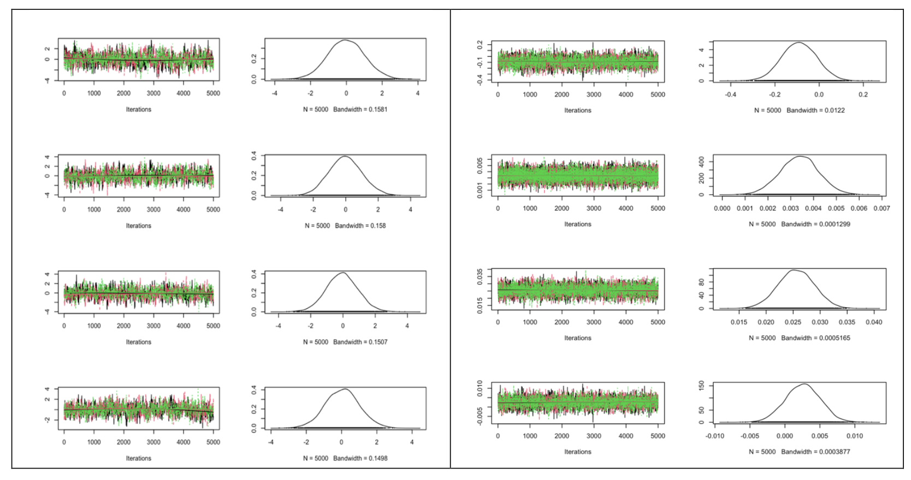
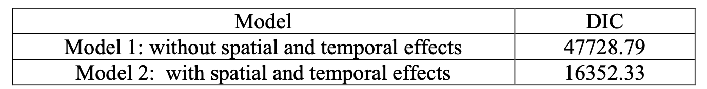

## Bayesian Modeling for Heart Disease Mortality Rate in Texas

### 1. Introduction

This project examines heart disease mortality trends in Texas, the second-largest U.S. state. It aims to analyze changes over time and assess how factors like smoking, diabetes, and obesity influence these trends.

### 2. Data Exploration and Visualization

Summary Statistics

Relative Risk

Map of the average standardized mortality rate of heart disease from 2011 to 2020

### 3. Missing Data

### 4. Bayesian Modeling

In this project, we compare the performance of two bayesian models with and without considering spatio-temporal effect. Below are the model specification of the two models.

#### 4.1 Model Specification

Model 1: Poisson model ignoring spatio-temporal effect

$$Y_{ij} \backsim Poi(E_{ij}\lambda_{ij})$$

$$log(\lambda_{ij}) = \beta_0 + \beta_1  X_{smoke} + \beta_2  X_{diabetes} + \beta_3  X_{obesity}$$

Priors: 

$$\beta_0, \beta_1, \beta_2, \beta_3 \backsim N(0,100)$$

Model 2: Bayesian spatio-temporal conditional autoregressive model

$$Y_{ij} \backsim Poi(E_{ij}\lambda_{ij})$$

$$log(\lambda_{ij}) = \beta_0 + \beta_1  X_{smoke} + \beta_2  X_{diabetes} + \beta_3  X_{obesity} + \psi_{ij}$$

Spatially autocorrelated 2nd order autoregressive process model:

$$\psi_{ij} = \rho_{T,1} \psi_{i-1,j}+\rho_{T,2}\psi_{i-2,j} + \epsilon_{ij}$$

Temporal prior:

$$\psi_{ij}|\psi_{i-1,j}, \psi_{i-2,j} \backsim N \bigg(\rho_{T,1} \psi_{i-1,j} + \rho_{T,2}\psi_{i-2,j} \frac{\tau^2}{\rho_s \sum_{k \ne j} w_{jk} + 1 -\rho_s} \bigg)$$

Spatial prior:

$$\epsilon_{ij}|\epsilon_{-ij}, W \backsim N \bigg(\frac{\rho_s \sum_{k \ne j} w_{jk} \epsilon_{ik}}{\rho_s \sum_{k \ne j} w_{jk} \epsilon_{ik} + 1 - \rho_s}, \frac{\tau^2}{\rho_s \sum_{k \ne j} w_{jk} + 1-\rho_s} \bigg)$$

Priors:

$$\beta_0, \beta_1, \beta_2, \beta_3 \backsim N(0,100)$$

Hyperpriors:

$$\tau^2 \backsim \text{Inverse-Gamma}(1, 0.01)$$

$$\rho_s \backsim \text{Uniform}(0,1)$$

$$f(\rho_{T,1}, \rho_{T,2}) \propto 1$$

#### 4.2 Checking convergence and diagnostics

Two methods were used to check the convergence of Markov chains for Model 1 and Model 2: trace plot and Gelman-Rubin diagnostic.

Trace plots for each parameter are shown below, indicating convergence of all three chains for each parameter in both models.

The Gelman-Rubin diagnostic checks if the chains have mixed well, with values below 1.1 showing good convergence. The gelman.diag function calculates this for each chain and all chains together. Table below shows a point estimate of 1 and a 95% confidence interval close to 1, along with a multivariate value of 1, indicating the chains are well mixed. 

Figure below shows the diagnostic plots, where the convergence measure drops near 1 for all chains. To avoid bias from the first 1000 iterations, it’s better to increase the number of burn-in iterations.

#### 4.3 Model Comparison

We compared the performance of Model 1 and Model 2 using DIC:

